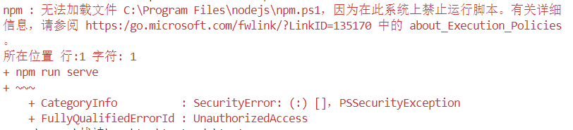

# Node.js 环境配置指南：配置 `node_global` 和 `node_cache`

## 目录
1. [安装 Node.js](#安装-nodejs)
2. [配置全局目录](#配置全局目录)
   - 2.1 [创建全局目录](#_2-1-创建全局目录)
   - 2.2 [配置环境变量](#_2-2-配置环境变量)

3. [验证配置](#验证配置)
4. [注意事项](#注意事项)

---

---

## 安装 Node.js
1. 访问 [Node.js 官网](https://nodejs.org/) 下载安装包
2. 推荐选择 **LTS 版本**（长期支持版）
3. 安装时勾选以下选项（Windows）：
   - ✅ `Add to PATH`
   - ✅ `Automatically install necessary tools`
   - 没有选项无脑下一步，除非你更换安装地址
   - 默认地址：`C:\Program Files\nodejs`

---

## 配置全局目录

### 2.1 创建全局目录

```bash
# 创建存放全局模块的目录（任意位置）
# C:\Program Files\nodejs下创建node_global模块目录
  C:\Program Files\nodejs\node_global    # Windows

# 创建缓存目录
# C:\Program Files\nodejs下创建node_cache缓存目录
  C:\Program Files\nodejs\node_cache     # Windows
```

### 2.2 配置环境变量

#### Windows 系统
1. 右键「此电脑」→「属性」→「高级系统设置」
2. 点击「环境变量」
3. 在「用户变量」中的「Path」中：
   - 替换的变量 `C:\User\用户名\AppDate\Roaming\npm`
   - 替换为「node_global」地址：`C:\Program Files\nodejs\node_global`
4. 在系统变量中
   - 新建变量 `NODE_HOME`，值：`C:\Program Files\nodejs`
   系统变量的「Path」中添加：
   - `%NODE_HOME%`
   - `%NODE_HOME%\node_global`
   - `%NODE_HOME%\node_cache`
---

## 验证配置
```bash
# 查看配置是否生效
npm config get prefix    # 应显示 node_global 路径
npm config get cache     # 应显示 node_cache 路径

# 如果路径不对请按以下设置

npm config set prefix + 路径    # 可设置 node_global 路径
npm config set cache + 路径     # 可设置 node_cache 路径

# 测试node
node -v

# 测试npm
npm -v
```

## npm镜像

   ### 检查当前npm镜像
   ```bash
   npm config get registry
   ```
   
   ::: info 镜像
   #### 设置npm淘宝镜像 (推荐)
   ```bash
   npm config set registry https://registry.npmmirror.com/
   ```

   #### npm默认地址
   ```bash
   npm config set registry https://registry.npmjs.org/
   ```

   #### 设置npm阿里云镜像
   ```bash
   npm config set registry https://npm.aliyun.com
   ```

   #### 设置npm华为云镜像
   ```bash
   npm config set registry https://mirrors.huaweicloud.com/repository/npm/
   ```

   #### 设置npm腾讯云镜像
   ```bash
   npm config set registry https://mirrors.cloud.tencent.com/npm/
   ```

   :::
---

## 注意事项及问题
1. **权限问题**：
   - 确保nodejs目录有管理权限
   - 选择nodejs文件夹 右键「属性」→「安全」→「编辑」→「组或用户名」→「完全控制」→「应用」→「确定」
2. **vscode和其他编译器使用npm无权限**：
   
   - 管理员启动PowerShell（Windows）输入
   ```bash
   Set-ExecutionPolicy -Scope CurrentUser -ExecutionPolicy RemoteSigned
   ```
> 配置完成后，所有 `npm install -g` 安装的包都会存储到 `node_global`，缓存文件将存放到 `node_cache`
